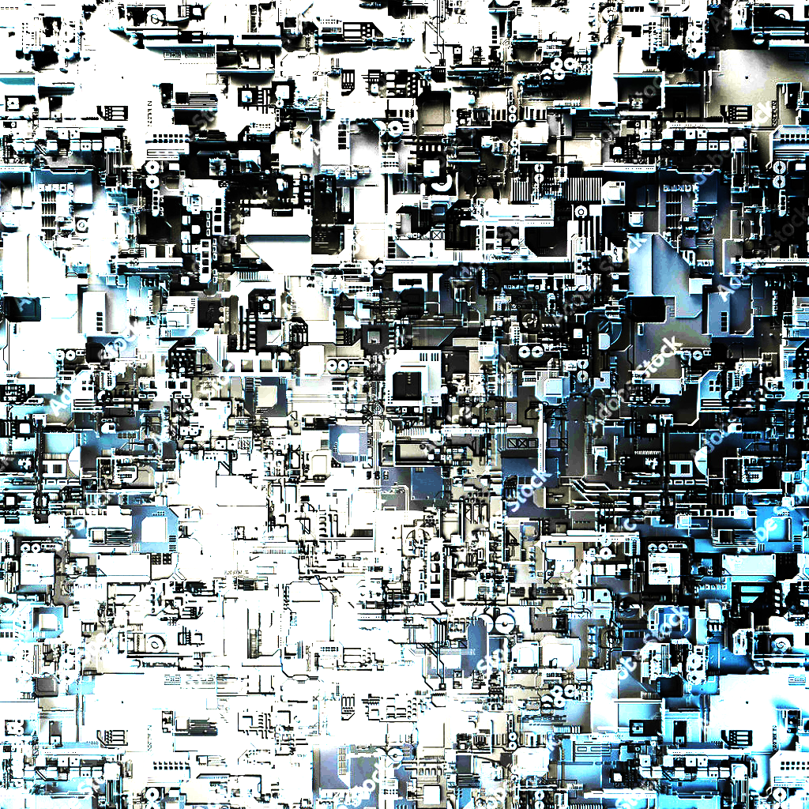
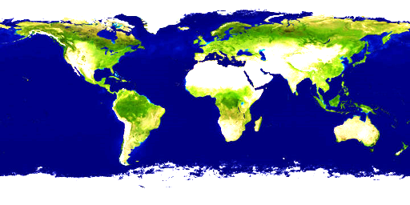

# spline aircraft

An aircraft made of surface of revolutions and extrusions that are created from splines. Can click ```start or stop movement``` button to start or stop the plane's rotation.






