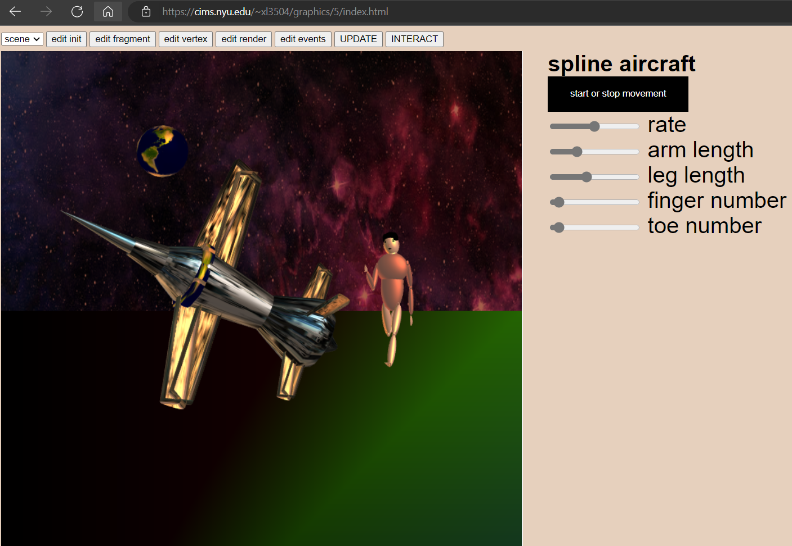
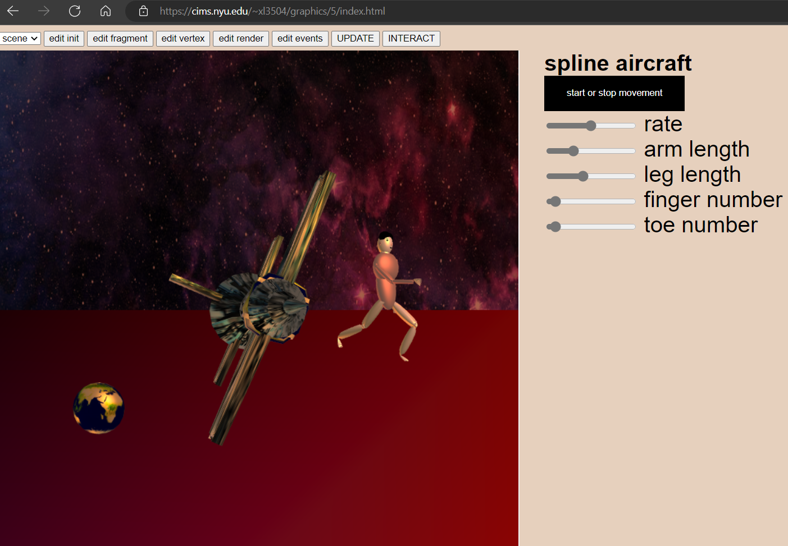
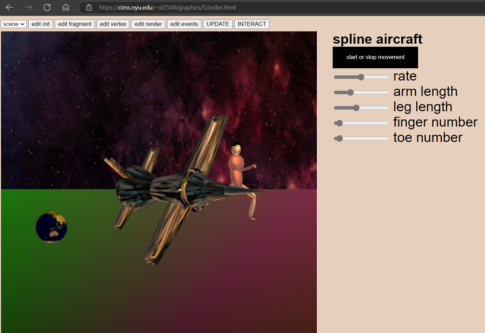
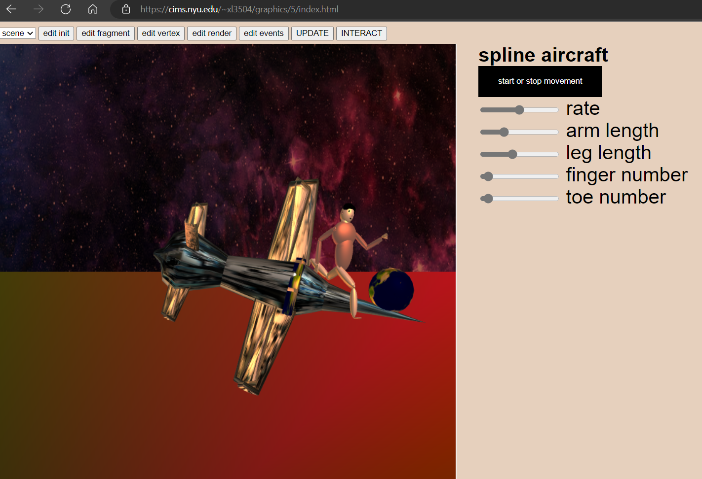
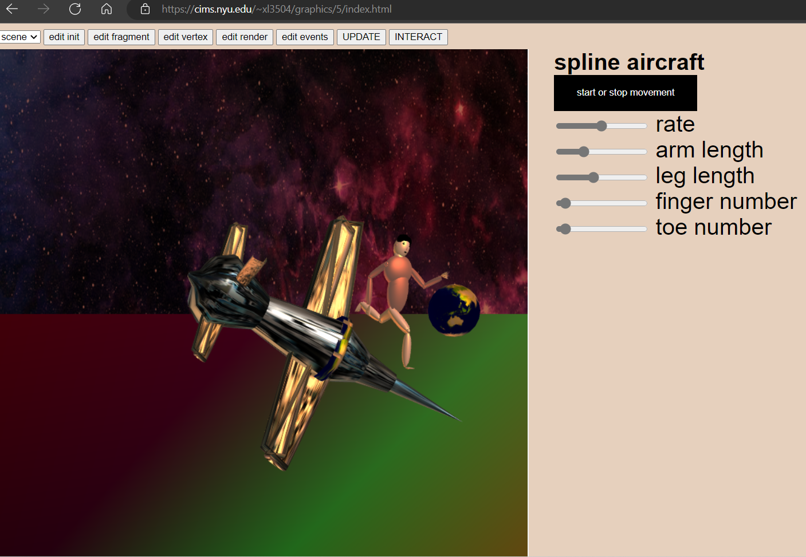

# spline aircraft


Xi Liu<br>
This project is done for computer graphics course at New York University, fall 2022, using WebGL.<br>
<br>
An aircraft made of meshes such as extrusions and surface of revolutions that are constructed from splines. Many different kinds of splines are created through bezier, hermite, catmull-rom, and b-spline matrices. For creation of the revolution mesh implemented in ```createRevolutionMesh()``` function, $z$ and $r$ values are computed through the ```evalCubicSpline()``` function, for the extrusion mesh, $x, y$, and $z$ values are computed through the ```evalCubicSpline()``` function, inside the ```evalCubicSpline()``` function, there is a ```splineValue()``` function that first transforms the matrix by multiplying the ```mat4 splineMatrix``` with the ```vec4 P``` and stores the result in $c$, and then using $c[0 : 4]$ as the coefficients of the returned cubic polynomial value at a point.<br>
<br>
To create an extrusion, suppose for a shape with a spline path, then for each sample point along the path, take the same cross section shape that are close to each other in space for sampling, which creates an uv mesh with u around the shape and v along the path, the difficulty in creating the extrusion mesh is when iterating along the v coordinate and changing from one level of the shape to the next level, need to compute the orientation around the moving line of the shape stamp that is different at each successive v. So, the orientation is computed as the following in the ```createExtrusionMesh()``` function: first, start from the front of the mesh, iterate and sample along v, for a matrix with a local z orientation is along the spline, whatever is chosen for the x orientation, the next point along the spline need to have the nearest possible x orientation (compared with the x orientation of the previous matrix) that is perpendicular the the new z orientation, each matrix need to be consistent with the previous one. The problem is given old z and x orientations, and new orientation z', need to find new orientation x'. So, first take the cross product between old x and old z to obtain old y (i.e., $z \times x = y$), then take the cross product between old y and new z' to obtain x' that is perpendicular to new z' and the x' is also perpendicular to old y (i.e., $y \times z' = x'$), and the new y' is the cross product between z' and x' (i.e., $z' \times x' = y'$). Now with the position of the next key point, $t$ parameter, and $x', y', z'$ orientations, can create the next level of the extrusion. An array of matrices is used, where each matrix is built for each sample.<br>
<br>
Can click ```start or stop movement``` button to start or stop the plane's rotation.






